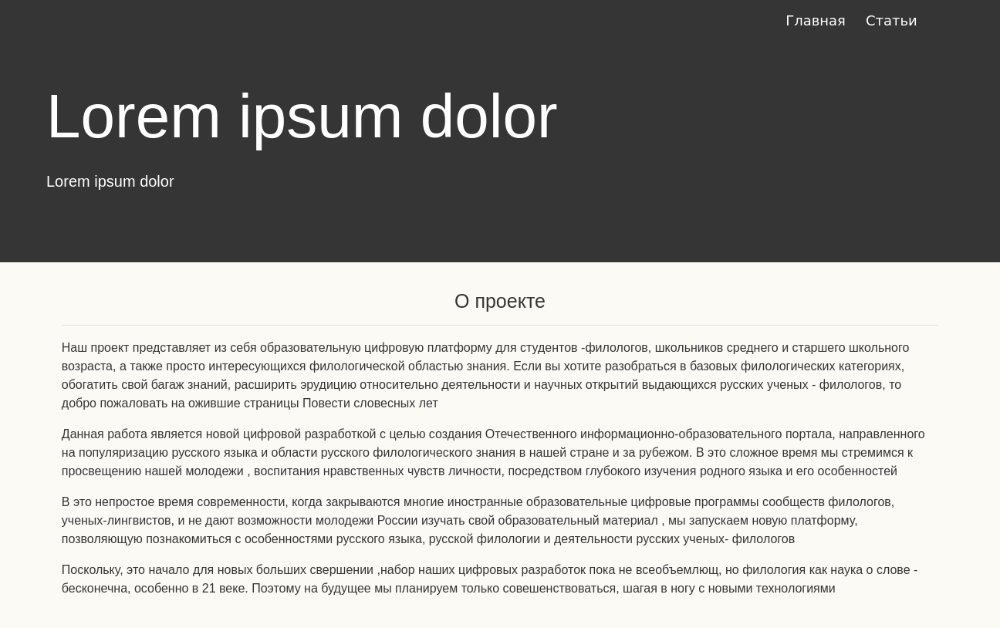
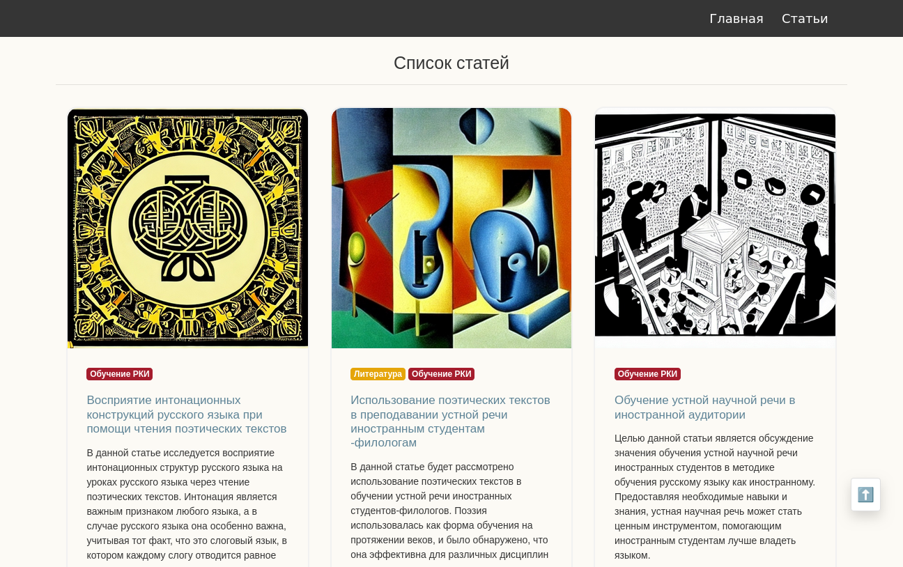
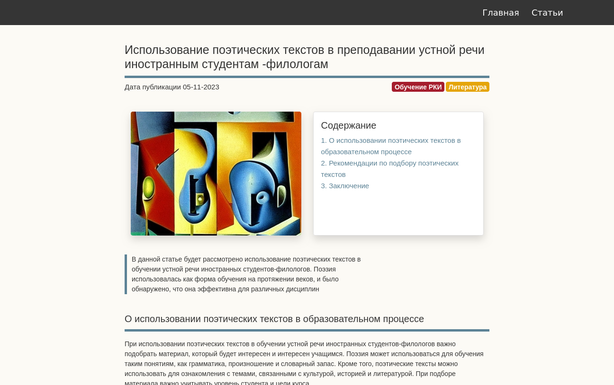

# New Horizon Project

Initially, this site was written to participate in the "knowledge" competition in the "new horizons" nomination as a platform for educating users in the field of learning the Russian language.

The source code of the platform is distributed under the license ..., but the texts of articles and other educational materials are not published.

## setup & start

makefile - control scripts for:
  * initial setup (copy .service file to systemd folder, install requirements) 
    `make setup` 

  * start, stop systemd service 
    `make start` 
    `make stop` 

  * maintaining systemd service 
    `cat-service` 
    `cat-log` 

## screenshots

1. Main page

2. The page with the article

3. The page with the article

